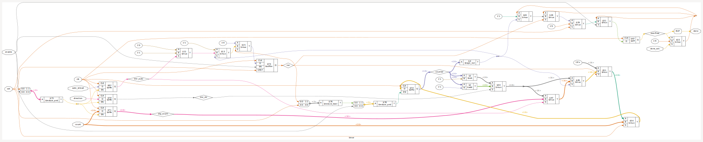
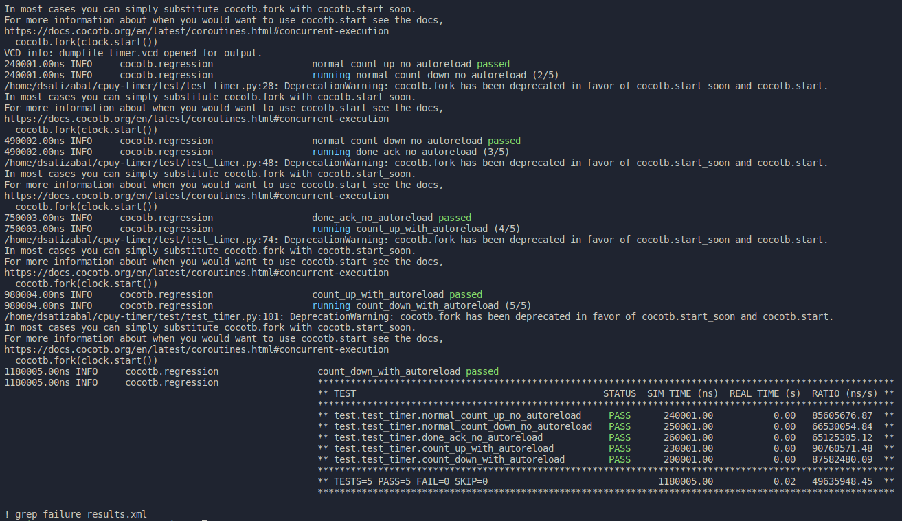
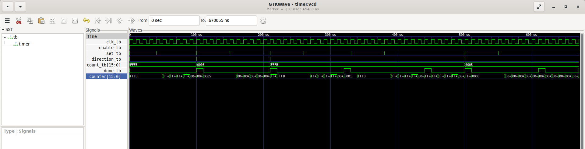

# Simple 16-bits timer peripheral

Implements a timer that can be used as a peripheral for a CPU implementation, intended to be used in a simple 8-bits CPU implementation to be sent for Tapeout with the [Dec 2023 Efabless shuttle](https://efabless.com/gf-180-open-mpw-shuttle-program)

## Inputs and Outputs description:

- clk: input of CPU clock
- enable: enables timer for operation
- set: sets count value and configurations (direction and auto reload)
- direction: sets the count direction, 0 is down, 1 is up
- auto_reload: sets autoreload mode for the timer
- done_ack: acknowledges done flag and sets it back to zero
- count: 16-bits wide value to count
- done: flag indicating overflow occurred in the count so desired time has elapsed

## Operation:

The timer counts every clock cycle, if counting the instructions cycles is desired the that clock can be generated and inputted to the timer instance.

The enable signal indicates if the timer operates or not, if set to high timer will operate in the configured mode, if set to low timer won't perfom any action.

The set signal is used to set the count and operation mode, by default the timer is set to no run any count unless the set signal has been held high for at least a clock cycle, thus avoiding any operation with random parameters. while set signal is held high the timer won't operate.

The set process saves internally the values of the count and also the direction and auto reload configurations, also, a copy of the count is saved independently of the timer operating in auto reload.

An internal flag named run is set to high only when the set signal has been set to high for at least a clock cycle, allowing the timer to start operate when the set signal is driven low again, the run flag allow the timer to start counting every clock cycle in the indicated direction.

When the count reaches zero (overflow of the 16-bits wide internal counter register), the internal overflow flag is set to high, this flag is later used to drive the done flag that will indicate the CPU that the timer has completed counting triggering any external event as desired (usually PC jumping to an interruption vector).

At the same time of the overflow event, if the auto reload flag is set the internal counter is assigned the original count value configured in the timer, the run flag is not set to zero so the timer can continue operating, if the auto reload flag is zero the the run flag is set to zero so the timer stops, only a set event will make it count again.

The overflow flag is only set back to zero when it is akcnowledged by the CPU by driving high for at least a clock cycle the done_ack input, this will give it the control so it can "view" the done event and properly activate the corresponding event.

## Synthetizing with YoSys:

Run:

```
make synth_timer
```

and you should see a YoSys window opening showing the synthesis like this (as per 10Nov2023 this looks pretty weird):



observe this synth does not use standard cells.

## Running CocoTB tests:

Type the following command to run tests:

```
make test_timer
```

you should see a result like this:



Observe in the Makefile that a dump_timer.v file is included and used to run the test command, in that file, the output file and the variables to be dumped (the name of the Top module) are defined, after running the test the corresponding .vcd (value change dump) file is created and you can proceed to view it with the GtkWave command:

```
make gtkwave_timer
```

a GtkWave window will open, you should see the hierarchy of the timer containing the available signals that can be displayed for examination, like in our case we're viewing the clk, count and done:



observe that for this case we're not using a verilog testbench but rather we're testing directly (Design Under Test or DUT for CocoTB) the corresponding modules.

As per 10Nov2023 the timer is having a malfunction that detects the overflow with a clock cycle delay.

## Running Formal Verification:

WIP
